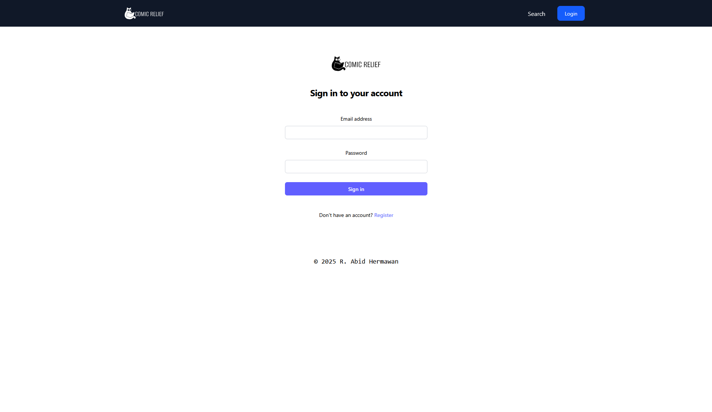

<p align="center">
    <picture>
      <source media="(prefers-color-scheme: dark)" srcset="mdassets/logo-white-full.svg">
      <source media="(prefers-color-scheme: light)" srcset="mdassets/logo-black-full.svg">
    </picture>
</p>

# Comic Relief

Project for Framework Programming class. Built for reading and uploading comics

Features : 
- Upload comics in ZIP/JPG format
- Reading comics uploaded by users
- View details such as title, details and genre

## Screenshots
### Main Page


### Details Page


### Update Details Page


### Login Page


## Comic ZIP format

```
.
└── {comic-zip}
    ├── cover.jpg
    ├── cover-small.jpg
    └── pages
        ├── 1.jpg
        ├── 2.jpg
        ├── ...
        ├── 10.jpg
        ├── ...
        └── n.jpg
```

## Command to run this on Linux
```bash
# Ensure Laravel is installed
composer install
composer global require laravel/installer
composer require zanysoft/laravel-zip

npm install && npm run build

cp .env.example .env
# Connect your database 

php artisan key:generate
php artisan migrate:fresh --seed
php artisan storage:link

# Running the server
composer run dev
```

## Notes
Seeder data are generated with placeholder data in public storage. Default login to modify those datas are <br>

Email : admin@admin.com <br>
Password : password